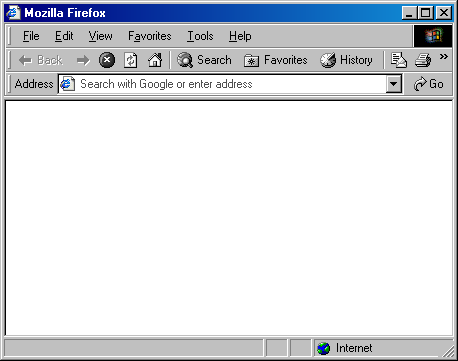

# MSFX

Fork of [the MSFX Firefox userChrome](https://github.com/WinClassic/MSFX).

## Changes

- Uses normal [firefox-scripts](https://github.com/xiaoxiaoflood/firefox-scripts) instead of a stripped down version for greater userscript compatibility
  - Fixed up for 117+ and now bundled with again, as the upstream repo's maintainer is MIA.
- More accurate styles in some places
  - Bookmarks bar folder menus
  - All tabs button
    - Replaced with overflow arrows icon
  - Scrollbars forced to light theme
  - Selected address bar forced to light theme
  - Resize grabber no longer appears when maximized
  - Autoplay Pending indicator icon replaced
  - Accurate menus (117+)
  - Unlocked toolbar style has proper bottom resizer (visual only)
  - Properly styled address bar dropdown
  - Proper hover/active states for menu bar items
  - Scrollbar dithering
- Internet status bar widget is its own component
  - Empty boxes have been removed in favor of putting extensions on the status bar
- Address bar is no longer forced to the Address toolbar (configurable, enabled by default)
- Works with Firefox 117+ (fixes developed for on 122.0b3)
  - A lot of legacy styling was removed to where the `appearance` property does nothing, everything that used this to achieve the classic style has been accurately recreated as best as possible.

## What's missing?

- The stock extensions menu, the main menu and the overflow tabs menu are not styled, as I do not personally use them.
- More configuration options probably. There might've been some things I commented out for my own liking that you may not agree with in terms of accuracy to IE5.
- Default favicons for bookmark items, as these cannot be changed in pure CSS. (needs investigation)
- Extension button tooltips don't seem to be standard tooltips.

## Known issues

- Opening "Customize Toolbar" resets the access key for the Favorites (bookmarks) menu item back to "B", resulting in "Favorites (B)"

## What can be improved?

- Stop using base64 URLs everywhere.
- More configuration.
- [Nested rulesets](https://developer.mozilla.org/en-US/docs/Web/CSS/CSS_nesting), since Firefox itself uses them everywhere. (117+)
  - Some of the 117+ fixes have been using them (e.g. context menus)
- Multiple files.

## Installation

- Set the following keys in `about:config`:
  - `toolkit.legacyUserProfileCustomizations.stylesheets` to `true`
  - `svg.context-properties.content.enabled` to `true`
  - `ui.prefersReducedMotion` to `1`
  - ~~`browser.display.windows.non_native_menus` to `0`~~ (removed in 117+)
- Copy the contents of `ffroot` into your Firefox install folder (typically `C:\Program Files\Mozilla Firefox`)
  - There is an extra set of folders added (`browser\chrome\icons\default`) to change the main window icon. The default is the IE5 page icon, but the 2001-2003 Mozilla icon is included as well, just needs to be renamed from `_main-window.ico` to `main-window.ico`.
- Merge `chrome` folder from the repo into your profile's `chrome` folder. (path can be found via `about:profiles` or `about:support`)

## Recommendations

- [Extensions Options Menu](https://raw.githubusercontent.com/xiaoxiaoflood/firefox-scripts/master/chrome/extensionOptionsMenu.uc.js)
  - More lightweight than the stock extensions menu, which is "hidden" by the theme anyways
- [userChromeJS Manager](https://raw.githubusercontent.com/xiaoxiaoflood/firefox-scripts/master/chrome/rebuild_userChrome.uc.js)
