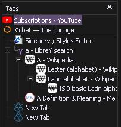

# Custom CSS for various extensions

Requires "Optional polyfill for missing legacy colors everywhere" userchrome JS (`msfx-expose_legacy_colors.uc.js`)

## [Sidebery](https://addons.mozilla.org/en-US/firefox/addon/sidebery/)

Paste CSS file into "Styles Editor" in Sidebery's config page

